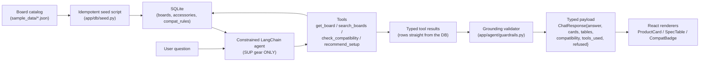

# BoardWise

[%3A%20pending%20publish-lightgrey)](https://github.com/TODO/boardwise/actions/workflows/ci.yml)
[](LICENSE)

A friendly, **domain-constrained chat agent** that helps shoppers pick stand-up paddleboard (SUP)
gear — grounded entirely in a structured product database, never in model memory. Ask it for a
beginner setup under $700 and it answers with real product cards, spec tables, and compatibility
badges pulled straight from the catalog, or it tells you it doesn't have that spec — it never
makes one up.

> ## ⚠️ All product data on this site is mock data
>
> Every brand, model name, and spec number in BoardWise (Aquara, Riptide, Zephyr, Cascade,
> Velocity, Fjord, and friends) is **fictional**, invented for this demo — illustrative mock data,
> not real product specifications. Nothing here describes a real, purchasable product. Every
> seeded row carries `is_mock: true`, and the same mock-data notice appears as a persistent banner
> in the UI (`frontend/src/components/`). This disclaimer does not leave this README.

<!-- DEMO GIF: captured at S25 -->
<!-- TODO(S25): replace this comment with an animated GIF showing a rider-profile question
     producing product cards + a comparison table + compat badges, per docs/SPEC.md "README". -->

## How it works



Off-topic questions never reach the tools at all: the refusal backstop short-circuits before the
agent runs, so `refused: true` always means **zero tool calls**, not just a polite-sounding reply.

## How the domain constraint works

BoardWise's anti-hallucination and off-topic protection is **not** "ask the model nicely." It is
three independent layers, documented in full in
[`backend/app/prompts/README.md`](backend/app/prompts/README.md):

1. **Versioned system prompt** (`backend/app/prompts/system_v1.md`) scopes the agent to SUP gear
   and instructs it to ground every spec/number in tool results and refuse anything off-topic.
   This is the first line of defense — but a prompt alone is not enforcement, since a model can
   still ignore it.
2. **Code-level grounding validator** (`backend/app/agent/guardrails.py::validate_grounding`) is a
   pure, LLM-free function that inspects the agent's answer against the union of that turn's tool
   results and strips or replaces any spec/number that cannot be traced back to a tool result —
   regardless of what the model said. It converts `kg` ↔ `lbs` for weight claims and parses
   feet-inches notation (`12'0"`) into decimal feet for length claims, and applies a rounding
   tolerance (the greater of ±0.5 or ±2% of the claimed value) to weight/length/volume claims so
   legitimate paraphrases ("about 150 L") aren't false-flagged — while PSI, price, and percent
   claims require exact equality, since those are the numbers a purchase decision hinges on. A
   spec the tools never returned is always stripped and replaced with *"I don't have that spec in
   my catalog."* This is where the grounding invariant is actually **enforced, in code** — the
   project's core integrity story.
3. **Refusal backstop** (`backend/app/agent/guardrails.py::is_in_domain`) is a deterministic
   keyword/pattern classifier — no embeddings, no extra model call — that runs *before* the agent
   is invoked. If a message looks off-topic, including jailbreak-shaped attempts to override the
   system prompt, the pipeline short-circuits to a refusal with zero tool runs, independent of
   what the system prompt would have produced. Policy: prefer a false refusal over an off-topic
   answer.

## Offline eval results

`make eval` drives the real `/api/chat` pipeline against labeled cases in `evals/cases.yaml`
through a canned, offline fake model (no network call, no `LLM_API_KEY` needed) and scores
correctness against DB ground truth, grounding/faithfulness, and out-of-domain refusal rate.

**This table is offline / mocked model — live-model results are added at the gated eval step,
`TODO(S24)`.**

```
$ make eval
python3 evals/run_evals.py --mode offline
model: fake-offline-v1
prompt_version: v1

category      cases   pass   rate
---------------------------------
correctness       5      5   1.00
grounding         2      2   1.00
refusal           2      2   1.00

avg tools/turn: 0.78
tool-error rate: 0.00
```

`TODO(S24)`: append the live-model table(s) here, one per validated provider, once a paid,
human-approved eval run exists.

## Quickstart

One command, no `.env` required — the catalog and UI work out of the box; chat requires an LLM key
supplied at runtime.

```bash
git clone <TODO: repo URL, added at publish — TODO(S26)>
cd boardwise
docker compose up
```

- Web (React, nginx): **http://localhost:3006**
- API (FastAPI): **http://localhost:8006** (`/api/health`, `/api/metrics`)

The `api` container seeds SQLite from `sample_data/*.json` idempotently on boot, so the catalog
and browsing UI are fully populated on first run with no key. To enable chat, copy
[`.env.example`](.env.example) to `.env` and set `LLM_API_KEY` (and optionally `LLM_BASE_URL` /
`LLM_MODEL`) before `docker compose up` — see [`docker-compose.yml`](docker-compose.yml) for how
those variables are wired into the `api` service.

## Tech stack & rationale

| Layer | Choice | Why |
|---|---|---|
| Frontend | React 18 + TypeScript + Vite, Tailwind CSS | Fast iteration, typed components, utility CSS matches the light/coastal visual identity without a custom design system |
| Data fetching | TanStack Query | Caching/loading/error states for `/api/boards` without hand-rolled fetch plumbing |
| Answer prose | `react-markdown` (prose only) | Specs render as typed components, never markdown — the model never emits raw JSX/HTML |
| Backend | Python 3.11, FastAPI + Uvicorn | Async-friendly, typed request/response models, small surface for a demo-sized API |
| Agent | LangChain tool-calling agent | Mature tool/function-calling loop with a swappable, injectable chat-model client |
| Contracts | Pydantic v2 (`backend/app/schemas.py`) | Single source of truth for the wire contract; hand-mirrored in `frontend/src/lib/types.ts` |
| Storage | SQLAlchemy 2.0 over SQLite, seeded from JSON | Zero-config clone-and-run — no external DB to stand up for a demo |
| LLM access | OpenAI-compatible client via env vars | Provider-agnostic: OpenAI, an Anthropic-compatible gateway, or a local function-calling model, no code changes |
| Packaging | Docker + Docker Compose | `web` (nginx static bundle, proxies `/api`) on 3006, `api` (Uvicorn) on 8006, both healthchecked |

**SQLite is a stated single-user constraint, not an oversight** (decision §4.2 of the build plan):
zero-config clone-and-run was prioritized over concurrent-write scalability, since this is a
demo/portfolio project, not a production multi-tenant service. A Postgres swap is a deliberately
out-of-scope stretch goal.

## Repository layout

```
backend/app/agent/      constrained agent, tools, guardrails (grounding + refusal)
backend/app/prompts/    versioned system prompt + tool descriptions (see README.md there)
backend/app/db/         SQLAlchemy models + idempotent JSON -> SQLite seeder
backend/app/schemas.py  frozen Pydantic v2 wire contract (ChatResponse, BoardCard, ...)
evals/                  offline eval harness (cases.yaml + run_evals.py)
frontend/src/            React app: chat pane, catalog panel, structured renderers
sample_data/            fictional board/accessory fixtures + example prompts
```

## Status

Segment 1 (S1–S22: data, agent, guardrails, frontend, eval harness, packaging, this README) is
built and offline-verified. `TODO(S23)`: a human-approved, paid live smoke test against a real
LLM key is the next gate, followed by `TODO(S24)` (paid live-model eval numbers above) and
`TODO(S25)` (the demo GIF at the top of this file). The repo is not yet public — `TODO(S26)`
publishes it once the CI badge above is remotely green and the pre-publish denylist/secret-scan
gates pass.

## License

MIT — see [`LICENSE`](LICENSE).
